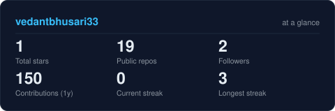
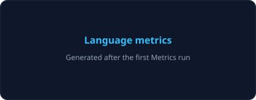
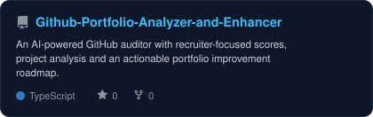
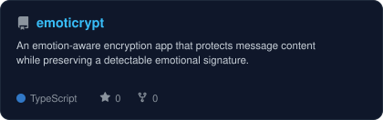
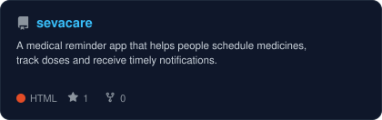
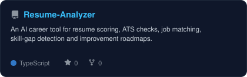

<div align="center">

<!-- Portrait generated locally from assets/profile-photo.png. -->


<br>

<!-- Animated identity banner -->
<a href="https://github.com/vedantbhusari33">
  
</a>

<br>

<!-- Contact links -->
<a href="https://www.linkedin.com/in/vedant-bhusari98765/"></a>
<a href="mailto:vedantbhusari33@gmail.com"></a>
<a href="https://portfolio-live-axgw.vercel.app/"></a>
<a href="https://github.com/vedantbhusari33"></a>

<br><br>


</div>

---

## `01 / about`

```console
$ whoami
```

Hi, I'm **Vedant Bhusari**, a final-year Electronics and Telecommunication Engineering student who enjoys building full-stack applications and connected IoT systems. I like taking practical problems from an idea to a working, demo-ready product.

- Currently building **Nova**, an ESP32-based voice assistant robot with a full-stack control dashboard
- Exploring **backend development, IoT integration, open source and DSA**
- Google Student Ambassador 2026 and GSSoC'26 contributor
- Fun fact: I learn fastest when there is a project, a deadline and a demo at the end

<br>

<div align="center">

## `02 / toolbox`


</div>

---

<div align="center">

## `03 / skills in two views`

<table>
<tr>
<td width="50%" align="center" valign="middle">

<!-- Starting values live in assets/skills.json and can be edited anytime. -->
<picture>
  <source media="(prefers-color-scheme: dark)" srcset="assets/radar-dark.svg">
  <source media="(prefers-color-scheme: light)" srcset="assets/radar-light.svg">
  
</picture>

</td>
<td width="50%" align="center" valign="middle">

<!-- Recalculated daily from language bytes in public repositories. -->
<picture>
  <source media="(prefers-color-scheme: dark)" srcset="assets/radar-langs-dark.svg">
  <source media="(prefers-color-scheme: light)" srcset="assets/radar-langs-light.svg">
  
</picture>

</td>
</tr>
</table>

</div>

---

<div align="center">

## `04 / contribution trail`

<!-- Generated every six hours by the Metrics workflow. -->


<br><br>

<!-- The output branch is created after the Snake workflow runs once. -->
<picture>
  <source media="(prefers-color-scheme: dark)" srcset="https://raw.githubusercontent.com/vedantbhusari33/vedantbhusari33/output/snake-dark.svg">
  <source media="(prefers-color-scheme: light)" srcset="https://raw.githubusercontent.com/vedantbhusari33/vedantbhusari33/output/snake.svg">
  
</picture>

</div>

---

<div align="center">

## `05 / GitHub at a glance`

<!-- Generated into this repository so the card does not depend on a public stats server. -->
<picture>
  <source media="(prefers-color-scheme: dark)" srcset="assets/card-stats-dark.svg">
  <source media="(prefers-color-scheme: light)" srcset="assets/card-stats-light.svg">
  
</picture>

<br>



</div>

---

<div align="center">

## `06 / selected work`

<!-- Project cards are regenerated daily from assets/projects.json. -->
<table>
<tr>
<td width="50%">
  <a href="https://github.com/vedantbhusari33/Github-Portfolio-Analyzer-and-Enhancer">
    <picture>
      <source media="(prefers-color-scheme: dark)" srcset="assets/card-Github-Portfolio-Analyzer-and-Enhancer-dark.svg">
      <source media="(prefers-color-scheme: light)" srcset="assets/card-Github-Portfolio-Analyzer-and-Enhancer-light.svg">
      
    </picture>
  </a>
</td>
<td width="50%">
  <a href="https://github.com/vedantbhusari33/emoticrypt">
    <picture>
      <source media="(prefers-color-scheme: dark)" srcset="assets/card-emoticrypt-dark.svg">
      <source media="(prefers-color-scheme: light)" srcset="assets/card-emoticrypt-light.svg">
      
    </picture>
  </a>
</td>
</tr>
<tr>
<td width="50%">
  <a href="https://github.com/vedantbhusari33/sevacare">
    <picture>
      <source media="(prefers-color-scheme: dark)" srcset="assets/card-sevacare-dark.svg">
      <source media="(prefers-color-scheme: light)" srcset="assets/card-sevacare-light.svg">
      
    </picture>
  </a>
</td>
<td width="50%">
  <a href="https://github.com/vedantbhusari33/Resume-Analyzer">
    <picture>
      <source media="(prefers-color-scheme: dark)" srcset="assets/card-Resume-Analyzer-dark.svg">
      <source media="(prefers-color-scheme: light)" srcset="assets/card-Resume-Analyzer-light.svg">
      
    </picture>
  </a>
</td>
</tr>
</table>

<sub>

| Project | Try it | Core stack |
|---|---|---|
| **[GitHub Portfolio Analyzer](https://github.com/vedantbhusari33/Github-Portfolio-Analyzer-and-Enhancer)** | [Demo video](https://drive.google.com/file/d/1aODOHcgvj1pehYtlRvb7mhVmHDH0p135/view?usp=drivesdk) | `React` `TypeScript` `Gemini` `GitHub API` |
| **[EmotiCrypt](https://github.com/vedantbhusari33/emoticrypt)** | [Live app](https://emoticrypt.vercel.app/) | `React` `TypeScript` `Transformers.js` `Web Crypto` |
| **[SevaCare](https://github.com/vedantbhusari33/sevacare)** | [Repository](https://github.com/vedantbhusari33/sevacare) | `React` `Node.js` `Express` `MongoDB` |
| **[Resume Analyzer](https://github.com/vedantbhusari33/Resume-Analyzer)** | [Live app](https://resume-analyzer-tan-three.vercel.app/) | `React` `Node.js` `Gemini` `MongoDB` |

</sub>

</div>

---

<div align="center">

<sub>Designed around useful projects, honest progress and things that actually work.</sub>

</div>
